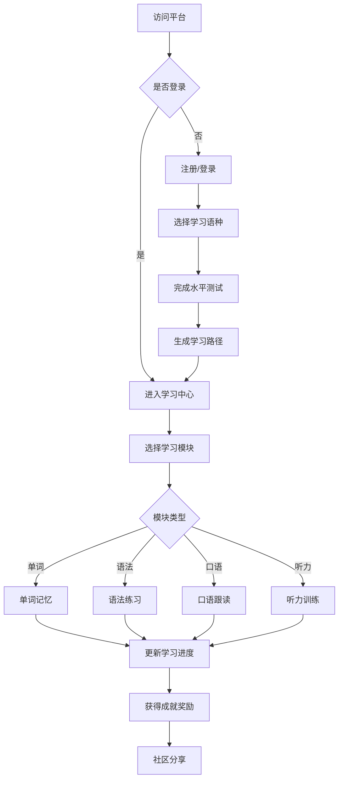

# LinguaFlow - 多语种在线教育平台产品需求文档

## 1. 产品概述

LinguaFlow 是一款沉浸式多语种在线学习平台，致力于为用户提供英语、日语、韩语等主流语言的系统性学习体验。平台通过互动式学习模块、个性化学习路径和成就激励系统，帮助用户高效掌握目标语言。

### 目标用户
- 语言学习初学者至中级进阶者
- 希望提升职场竞争力的职场人士
- 对多语言文化感兴趣的学习爱好者
- 准备留学或移民的语言备考人群

### 核心价值
- 一站式多语言学习解决方案
- 游戏化学习体验提升用户粘性
- 个性化学习路径提高学习效率
- 沉浸式语言环境打造真实语感

## 2. 核心功能模块

### 2.1 用户角色

| 角色 | 注册方式 | 核心权限 |
|------|----------|----------|
| 游客 | 无需注册 | 浏览平台介绍、查看公开课程信息 |
| 注册用户 | 邮箱/手机号注册 | 使用全部学习功能、追踪进度、发表社区动态 |
| 管理员 | 后台分配 | 用户管理、课程管理、内容审核 |

### 2.2 功能模块列表

#### 首页模块
1. **Hero区域** - 展示平台核心价值主张，支持语种切换
2. **特色介绍** - 展示四大核心学习模块（单词记忆、语法练习、口语跟读、听力训练）
3. **课程推荐** - 基于用户偏好的个性化课程展示
4. **用户评价** - 真实学习者反馈展示

#### 学习模块
1. **分级课程体系**
   - CEFR等级划分（A1-C2）
   - 语种分类导航（英语/日语/韩语）
   - 课程难度提示与学习时长预估

2. **单词记忆模块**
   - 智能单词卡片翻转效果
   - 艾宾浩斯遗忘曲线复习提醒
   - 例句语境展示
   - 收藏与生词本功能

3. **语法练习模块**
   - 互动式填空练习
   - 即时错误反馈与解析
   - 语法知识点关联

4. **口语跟读模块**
   - 语音识别评分系统
   - 波形可视化对比
   - 语速调节功能
   - 跟读历史回放

5. **听力训练模块**
   - 分级听力材料库
   - 语速调节与循环播放
   - 听力原文与翻译对照
   - 听写练习模式

#### 用户中心
1. **学习进度追踪**
   - 每日/每周/每月学习数据统计
   - 学习时长热力图
   - 能力雷达图展示
   - 课程完成进度

2. **个性化推荐**
   - 基于学习历史推荐下一课程
   - 薄弱环节强化练习
   - 学习目标设定与提醒

3. **成就激励系统**
   - 徽章成就收集
   - 学习连续天数记录
   - 等级称号升级
   - 排行榜竞争

#### 社区模块
1. **动态广场**
   - 学习心得分享
   - 笔记资料上传
   - 学习打卡记录
   - 评论互动功能

2. **学习小组**
   - 按语种/目标分组
   - 组内学习挑战
   - 互助答疑讨论

#### 认证系统
1. **用户注册登录**
   - 邮箱注册与登录
   - 登录状态保持
   - 密码找回功能

## 3. 核心用户流程

### 3.1 新用户首次使用流程

```
用户访问 → 首页浏览 → 注册账号 → 选择学习语种
→ 完成水平测试 → 获取个性化学习路径 → 开始学习
```

### 3.2 每日学习流程

```
登录 → 查看学习提醒 → 进入课程学习 → 完成练习
→ 查看进度更新 → 获得成就奖励 → 社区分享交流
```

### 3.3 流程图



## 4. 界面设计规范

### 4.1 设计风格

#### 色彩系统
- **主色调**: 深海蓝 #1E3A5F - 传达信任与专业
- **辅助色**: 珊瑚橙 #FF6B6B - 活力与热情
- **强调色**: 翡翠绿 #2ECC71 - 成功与进步
- **背景色**: 雪白 #FAFBFC - 清新简洁
- **文字色**: 深灰 #2C3E50 - 易读舒适

#### 字体规范
- **标题字体**: Poppins - 现代几何感
- **正文字体**: Noto Sans SC - 优秀的中日韩显示
- **辅助字体**: Source Code Pro - 代码/音标显示

#### 按钮样式
- 圆角按钮 (border-radius: 12px)
- 悬停阴影效果
- 点击反馈动画
- 渐变填充(primary按钮)

#### 图标风格
- 使用 Lucide Icons 图标库
- 线性风格统一
- 悬停时颜色变化

### 4.2 页面布局

#### 首页布局
- 顶部固定导航栏
- Hero区域占据首屏
- 卡片式模块展示
- 网格布局的课程列表
- 响应式底部备案栏

#### 学习页面布局
- 左侧边栏课程目录
- 主内容区域（视频/练习区）
- 右侧进度追踪面板
- 底部快捷操作栏

### 4.3 响应式设计

采用桌面优先设计，移动端适配原则：
- 导航栏折叠为汉堡菜单
- 侧边栏转为底部标签栏
- 卡片列表转为单列布局
- 保持核心功能可用性

### 4.4 交互动效

- 页面切换：淡入淡出 (300ms ease)
- 卡片悬停：上浮 + 阴影增强
- 按钮点击：缩放反馈 (scale: 0.95)
- 进度更新：数值动画过渡
- 成就获得：弹窗 + 粒子特效
- 加载状态：骨架屏占位

## 5. 项目名称与品牌

### 项目名称: **LinguaFlow**

### 名称含义
- **Lingua**: 源自拉丁语，意为"语言"，象征语言的深度与历史
- **Flow**: 流畅、流动，代表学习过程的自然流畅性
- 整体寓意：让语言学习成为一种流畅自然的体验

### 品牌色彩
- Logo采用深海蓝与翡翠绿渐变
- 象征从初学(蓝)到精通(绿)的成长旅程

### 视觉标识
- 以"L"和"F"字母变形为书本/翅膀造型
- 配合流畅的曲线连接
- 体现语言学习的优雅与力量
