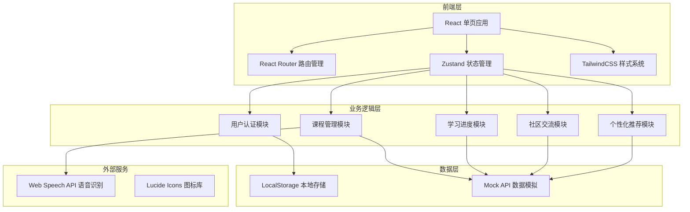
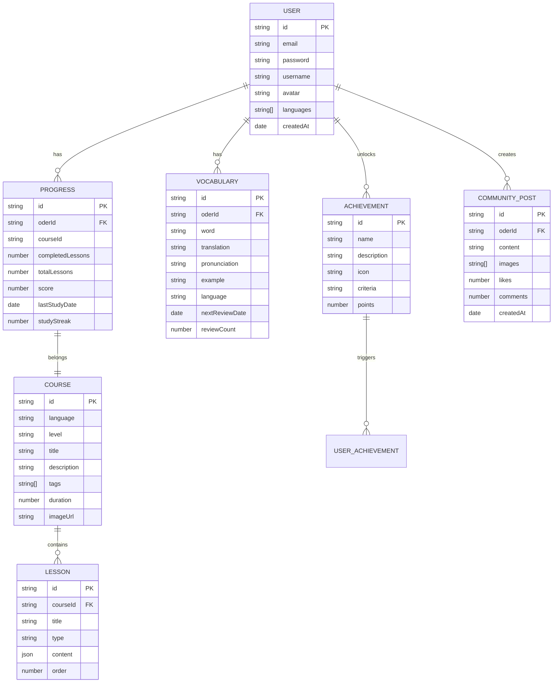

# LinguaFlow - 多语种在线教育平台技术架构文档

## 1. 架构设计

### 1.1 系统架构图



### 1.2 技术栈概览

| 层级 | 技术选型 | 版本要求 | 说明 |
|------|----------|----------|------|
| 前端框架 | React | 18.x | 高性能组件化开发 |
| 构建工具 | Vite | 5.x | 快速开发体验 |
| 路由管理 | React Router | 6.x | SPA路由支持 |
| 状态管理 | Zustand | 4.x | 轻量级状态管理 |
| 样式方案 | TailwindCSS | 3.x | 原子化CSS |
| 图标库 | Lucide React | 最新版 | 统一图标风格 |
| 动画库 | Framer Motion | 11.x | 流畅交互动画 |
| 图表库 | Recharts | 2.x | 数据可视化 |

## 2. 路由定义

### 2.1 路由结构

| 路由路径 | 页面组件 | 功能描述 | 访问权限 |
|----------|----------|----------|----------|
| `/` | HomePage | 首页、平台介绍 | 公开 |
| `/login` | LoginPage | 用户登录 | 公开 |
| `/register` | RegisterPage | 用户注册 | 公开 |
| `/learn/:language` | LearnPage | 学习中心主页 | 需要登录 |
| `/learn/:language/:courseId` | CoursePage | 课程内容页 | 需要登录 |
| `/vocabulary` | VocabularyPage | 单词记忆模块 | 需要登录 |
| `/grammar` | GrammarPage | 语法练习模块 | 需要登录 |
| `/speaking` | SpeakingPage | 口语跟读模块 | 需要登录 |
| `/listening` | ListeningPage | 听力训练模块 | 需要登录 |
| `/progress` | ProgressPage | 学习进度追踪 | 需要登录 |
| `/community` | CommunityPage | 社区广场 | 需要登录 |
| `/profile` | ProfilePage | 个人中心 | 需要登录 |
| `/achievements` | AchievementsPage | 成就系统 | 需要登录 |

### 2.2 路由组织结构

```
src/
├── pages/
│   ├── Home/
│   │   └── HomePage.tsx
│   ├── Auth/
│   │   ├── LoginPage.tsx
│   │   └── RegisterPage.tsx
│   ├── Learn/
│   │   ├── LearnPage.tsx
│   │   ├── CoursePage.tsx
│   │   ├── VocabularyPage.tsx
│   │   ├── GrammarPage.tsx
│   │   ├── SpeakingPage.tsx
│   │   └── ListeningPage.tsx
│   ├── Progress/
│   │   └── ProgressPage.tsx
│   ├── Community/
│   │   └── CommunityPage.tsx
│   └── Profile/
│       ├── ProfilePage.tsx
│       └── AchievementsPage.tsx
```

## 3. 数据模型设计

### 3.1 实体关系图



### 3.2 核心数据类型定义

```typescript
// 用户类型
interface User {
  id: string;
  email: string;
  username: string;
  avatar?: string;
  languages: ('english' | 'japanese' | 'korean')[];
  level: Record<string, 'A1' | 'A2' | 'B1' | 'B2' | 'C1' | 'C2'>;
  streak: number;
  totalStudyTime: number;
  createdAt: Date;
}

// 课程类型
interface Course {
  id: string;
  language: 'english' | 'japanese' | 'korean';
  level: 'A1' | 'A2' | 'B1' | 'B2' | 'C1' | 'C2';
  title: string;
  titleCn: string;
  description: string;
  lessons: Lesson[];
  duration: number;
  enrolledCount: number;
  imageUrl: string;
  tags: string[];
}

// 单词类型
interface Vocabulary {
  id: string;
  word: string;
  reading?: string;
  translation: string;
  pronunciation: string;
  example: string;
  exampleTranslation: string;
  language: 'english' | 'japanese' | 'korean';
  difficulty: number;
  mastery: number;
  nextReview: Date;
}

// 成就类型
interface Achievement {
  id: string;
  name: string;
  nameCn: string;
  description: string;
  descriptionCn: string;
  icon: string;
  category: 'streak' | 'progress' | 'social' | 'special';
  requirement: number;
  reward: number;
  unlocked: boolean;
  unlockedAt?: Date;
}

// 社区帖子类型
interface Post {
  id: string;
  userId: string;
  userName: string;
  userAvatar: string;
  content: string;
  images: string[];
  language?: string;
  likes: number;
  comments: number;
  isLiked: boolean;
  createdAt: Date;
}

// 学习进度类型
interface StudyProgress {
  courseId: string;
  lessonId: string;
  completed: boolean;
  score: number;
  timeSpent: number;
  lastStudied: Date;
}
```

## 4. 页面详细设计

### 4.1 首页 (HomePage)

#### 组件结构
```
HomePage
├── Header (导航栏)
│   ├── Logo
│   ├── Navigation
│   ├── LanguageSwitcher
│   └── UserMenu (登录后)
├── HeroSection (首屏英雄区)
│   ├── Headline
│   ├── Subtitle
│   ├── CTAButtons
│   └── HeroIllustration
├── FeaturesSection (功能特色)
│   ├── VocabularyCard
│   ├── GrammarCard
│   ├── SpeakingCard
│   └── ListeningCard
├── CoursesSection (课程推荐)
│   ├── LanguageTabs
│   └── CourseGrid
├── TestimonialsSection (用户评价)
└── Footer (页脚)
```

#### 设计规范
- **Hero高度**: 100vh (减去导航栏)
- **卡片尺寸**: 宽度 280px，高度自适应
- **间距**: 组件间距 80px，元素间距 24px
- **动画**: 元素依次淡入，间隔 100ms

### 4.2 学习中心 (LearnPage)

#### 组件结构
```
LearnPage
├── Sidebar (左侧边栏)
│   ├── CourseList
│   ├── ProgressOverview
│   └── QuickActions
├── MainContent (主内容区)
│   ├── CourseHeader
│   ├── LessonList
│   └── ContinueLearning
└── RightPanel (右侧面板)
    ├── DailyGoal
    ├── StudyStreak
    └── RecommendedCourses
```

#### 设计规范
- **侧边栏宽度**: 280px
- **右侧面板宽度**: 320px
- **主内容区**: flex-1，最小宽度 600px
- **响应式**: 移动端隐藏侧边栏

### 4.3 单词记忆 (VocabularyPage)

#### 组件结构
```
VocabularyPage
├── Header
│   ├── WordCount
│   └── FilterOptions
├── FlashCard
│   ├── CardFront
│   │   ├── Word
│   │   ├── Pronunciation
│   │   └── AudioButton
│   └── CardBack
│       ├── Translation
│       ├── Example
│       └── ExampleTranslation
├── Controls
│   ├── FlipButton
│   ├── DifficultyRating
│   └── NextCard
└── Progress
    ├── CardsRemaining
    └── SessionStats
```

#### 交互设计
- **卡片翻转**: 3D 翻转动画 (0.6s)
- **难度按钮**: 忘记/模糊/记住 三档
- **键盘快捷键**: 空格翻转，1-3难度评级

### 4.4 口语跟读 (SpeakingPage)

#### 组件结构
```
SpeakingPage
├── Header
├── AudioVisualizer
│   ├── ReferenceWaveform
│   └── UserWaveform
├── TextDisplay
│   ├── OriginalText
│   ├── HighlightedText
│   └── Translation
├── Controls
│   ├── RecordButton
│   ├── PlayButton
│   ├── SpeedControl
│   └── RetryButton
└── ScoringPanel
    ├── OverallScore
    ├── PronunciationScore
    └── FluencyScore
```

#### 技术实现
- 使用 Web Speech API 进行语音识别
- 音频可视化使用 Canvas 绘制波形
- 评分算法: 发音准确度 60%，流畅度 40%

### 4.5 进度追踪 (ProgressPage)

#### 组件结构
```
ProgressPage
├── Header
│   └── TimeRangeSelector
├── OverviewCards
│   ├── TotalStudyTime
│   ├── CurrentStreak
│   ├── WordsLearned
│   └── CoursesCompleted
├── HeatmapCalendar
├── AbilityRadar (能力雷达图)
│   ├── Vocabulary
│   ├── Grammar
│   ├── Speaking
│   └── Listening
└── RecentActivity
    ├── TodayActivities
    └── WeeklyChart
```

#### 图表配置
- **热力图**: 使用 GitHub 风格布局
- **雷达图**: 5维度能力展示
- **柱状图**: 周学习时长统计
- **动画**: 数据加载时渐进显示

### 4.6 社区 (CommunityPage)

#### 组件结构
```
CommunityPage
├── Header
│   ├── SearchBar
│   └── FilterDropdown
├── PostComposer
│   ├── Avatar
│   ├── TextArea
│   └── MediaUpload
├── PostFeed
│   └── PostCard (循环)
│       ├── PostHeader
│       ├── PostContent
│       ├── PostMedia
│       ├── PostActions
│       └── Comments
└── Sidebar
    ├── TrendingTags
    ├── ActiveUsers
    └── QuickLinks
```

#### 设计规范
- **帖子卡片**: 白色背景，圆角 16px
- **间距**: 卡片间距 24px
- **图片**: 最大宽度 100%，圆角 12px
- **评论**: 缩进显示，层级最多3级

## 5. 状态管理

### 5.1 Zustand Store 结构

```typescript
// 用户状态
interface AuthStore {
  user: User | null;
  isAuthenticated: boolean;
  login: (email: string, password: string) => Promise<void>;
  register: (email: string, username: string, password: string) => Promise<void>;
  logout: () => void;
}

// 学习状态
interface LearningStore {
  currentCourse: Course | null;
  currentLesson: Lesson | null;
  progress: StudyProgress[];
  vocabulary: Vocabulary[];
  setCourse: (course: Course) => void;
  updateProgress: (lessonId: string, score: number) => void;
  addVocabulary: (word: Vocabulary) => void;
}

// 成就状态
interface AchievementStore {
  achievements: Achievement[];
  unlockedIds: string[];
  totalPoints: number;
  unlock: (id: string) => void;
  checkAchievements: () => void;
}

// 社区状态
interface CommunityStore {
  posts: Post[];
  loading: boolean;
  createPost: (content: string) => Promise<void>;
  likePost: (postId: string) => void;
  loadPosts: () => Promise<void>;
}
```

## 6. 性能优化策略

### 6.1 代码分割
- 使用 React.lazy() 懒加载页面组件
- 按路由分割代码块
- 公共依赖抽取为独立 chunk

### 6.2 资源优化
- 图片使用 WebP 格式
- 图标按需导入
- 字体使用 font-display: swap

### 6.3 缓存策略
- 静态资源缓存一年
- API 响应本地缓存
- 离线学习数据同步

### 6.4 渲染优化
- 列表虚拟化 (react-window)
- 组件 memo 优化
- 防抖节流用户输入

## 7. 项目初始化

### 7.1 创建项目

```bash
# 使用 Vite 创建 React + TypeScript 项目
npm create vite@latest linguaflow -- --template react-ts

# 进入项目目录
cd linguaflow

# 安装依赖
npm install

# 安装路由
npm install react-router-dom

# 安装状态管理
npm install zustand

# 安装样式
npm install -D tailwindcss postcss autoprefixer
npx tailwindcss init -p

# 安装图标
npm install lucide-react

# 安装动画
npm install framer-motion

# 安装图表
npm install recharts
```

### 7.2 目录结构

```
linguaflow/
├── src/
│   ├── assets/
│   │   ├── images/
│   │   └── icons/
│   ├── components/
│   │   ├── common/
│   │   ├── layout/
│   │   └── features/
│   ├── pages/
│   ├── stores/
│   ├── hooks/
│   ├── utils/
│   ├── data/
│   │   └── mock/
│   ├── styles/
│   ├── types/
│   ├── App.tsx
│   ├── main.tsx
│   └── index.css
├── public/
├── .env
├── package.json
├── tsconfig.json
├── vite.config.ts
├── tailwind.config.js
└── index.html
```

## 8. 开发规范

### 8.1 代码风格
- 使用 ESLint + Prettier 统一代码格式
- TypeScript 严格模式
- 函数组件 + Hooks

### 8.2 Git 提交规范
```
feat: 新功能
fix: 修复bug
docs: 文档更新
style: 代码格式
refactor: 重构
test: 测试
chore: 构建/工具
```

### 8.3 分支策略
- main: 主分支
- develop: 开发分支
- feature/: 功能分支
- fix/: 修复分支

## 9. 测试策略

### 9.1 单元测试
- 使用 Vitest 测试工具
- 组件测试覆盖率 > 80%
- 核心业务逻辑 100% 覆盖

### 9.2 集成测试
- 页面流程测试
- 用户交互测试
- 表单验证测试

### 9.3 E2E 测试
- Playwright 自动化测试
- 关键用户路径覆盖
- 跨浏览器兼容性

## 10. 部署方案

### 10.1 构建输出
```bash
# 开发环境
npm run dev

# 生产构建
npm run build

# 预览构建结果
npm run preview
```

### 10.2 环境变量
```
VITE_API_BASE_URL=/
VITE_APP_TITLE=LinguaFlow
VITE_APP_VERSION=1.0.0
```

### 10.3 部署配置
- 使用 Vercel/Netlify 静态部署
- 构建产物部署到 CDN
- 环境变量注入
